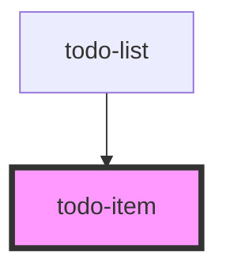

# todo-item

<!-- Auto Generated Below -->

## Properties

| Property    | Attribute   | Description | Type      | Default     |
| ----------- | ----------- | ----------- | --------- | ----------- |
| `completed` | `completed` |             | `boolean` | `false`     |
| `text`      | `text`      |             | `string`  | `undefined` |

## Events

| Event          | Description | Type               |
| -------------- | ----------- | ------------------ |
| `item-changed` |             | `CustomEvent<any>` |
| `item-check`   |             | `CustomEvent<any>` |
| `item-remove`  |             | `CustomEvent<any>` |

## Dependencies

### Used by

 - [todo-list](../todo-list)

### Graph

----------------------------------------------

*Built with [StencilJS](https://stenciljs.com/)*
