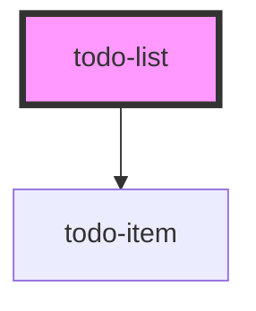

# todo-list

<!-- Auto Generated Below -->

## Properties

| Property | Attribute | Description | Type     | Default     |
| -------- | --------- | ----------- | -------- | ----------- |
| `todos`  | `todos`   |             | `string` | `undefined` |

## Events

| Event         | Description | Type               |
| ------------- | ----------- | ------------------ |
| `change-todo` |             | `CustomEvent<any>` |
| `check-todo`  |             | `CustomEvent<any>` |
| `remove-todo` |             | `CustomEvent<any>` |

## Dependencies

### Depends on

- [todo-item](../todo-item)

### Graph

----------------------------------------------

*Built with [StencilJS](https://stenciljs.com/)*
